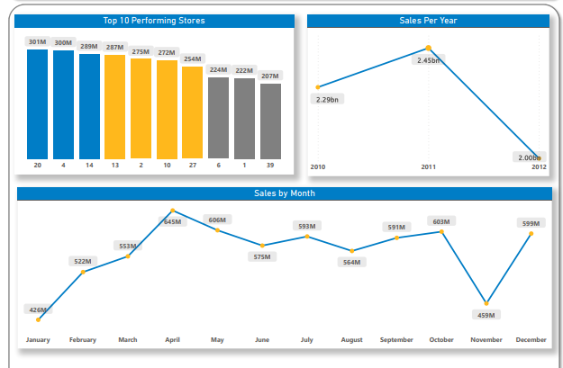

# Walmart Store Analysis

## Introduction: 
Walmart is an American Multinational retail Corporation that Operates a Chain of Hypermarkets (Supercenters). Working with Their Dataset of 2010 -2012 from Kaggle, I was Able to Generate Data In solving Some Seasonal and Correlation Analysis Questions in Order to Improve the Growth of the Stores.

## Problem Statement
Following the Download of the Dataset, The Data Contained A file which has a table Consisting of 7 Columns and 6400+ rows, The Columns Were: Store_Number , Weekly sales Count, Temperature, Holiday_Flag, CPI, Fuel_Price, Unemployment_Rate . This Columns Lead Me to Generate the Business Intelligence Questions For the Seasonal and Correlation(Based on Constant Variables such as Holiday Flag, Temperature, e.t.c) Analysis Questions Which are Outlined below 🧐
### Seasonal Analysis Questions:
- Stores Overview/Total Sales
- Top 10 Performing Stores
- Sales Trend by Year
- Sales Trend by Month
### Correlation Analysis Questions:
- Temperature Impact on Total Sales
- Holiday Flag Impact on Total Sales
- Customer Price Index (CPI) Impact on Total Sales
- Fuel Price Impact on sales

## Skills Demonstrated/Tool Used
#### Skills demonstrated included; 
Data Sourcing, Business Intelligence Questions Resolve Using Data analysis, Data Transformation, Data Visualization. 
#### Tool Used Included:
Power BI for Data Transformation and Visualizations, Kaggle for Data Sourcing
## Data Transformation/Modelling
- Data Transformation was Done on the Date Table Alone, By Changing the Auto-Recognition of the Date Table from Text Data Type to Date Data Type in The Data Transformation Tab in Power BI 

- Data Modelling Was Not Carried Due to the Conciseness of the Document
 

## Data Analysis and Visualizations
### Store Overview

### Seasonal Analysis 

- **Top Performing Stores**: Store 20 performed the best with sales of 301 million (M), followed by Store 4 and Store 14 with sales of 300M and 289M respectively. Store 39 was the 10th top-performing store with sales of 207M.

- **Sales per Year**: The highest sales were observed in 2011 with 2.45 billion (bn), followed by 2010 with 2.29bn and 2012 with 2.00bn. This indicates a positive growth trend over the years.

- **Sales per Month**: The month of April had the highest sales with a sum of 645M, followed by January with 426M. November had the lowest sales with only 459M. This suggests that April and January are particularly strong months for sales, while November experiences a drop in sales.
  
### Correlation Analysis

-  **Holiday Flag**: Sales amounted to 2.4bn when there were no holidays, but only 200M when holidays were present. This indicates that holidays have a significant impact on sales, with lower sales during holiday periods.

- **Sales by Temperature**: A sum of 7.9M+ was generated when temperatures were at 46.66°C. This suggests that extremely high temperatures might affect sales positively, possibly due to increased demand for seasonal products or air conditioning-related purchases.

- **Sales by Fuel Price**: Sales amounted to 17M+ when the fuel price was at $3.63. This implies that customers may reduce spending or modify their purchasing behavior when fuel prices are high, resulting in lower sales.

-  **Sales by CPI (Customer Price Index)**: Sales amounted to 10.8M+ when the CPI was at 126.98. This indicates that changes in the CPI can influence consumer spending patterns, with higher CPI potentially leading to increased sales.

## Conclusions:

1. Store 20 consistently performs well and should be studied for best practices that can be replicated in other stores.
2.  Sales have shown an overall positive trend over the years, with 2011 being the strongest year. Efforts should be made to sustain and further improve sales growth.
3.  January and April are strong months for sales, while November experiences lower sales. Strategies should be developed to boost sales during the slower months.

## Recommendations:

-  Holidays present an opportunity to drive sales, so promotional activities and targeted marketing campaigns should be planned around holiday periods.
-  During periods of high temperatures, consider stocking seasonal products and adjusting marketing messages to capitalize on increased demand.
-  Monitor fuel prices and adjust pricing strategies or introduce cost-saving promotions during periods of high fuel prices to mitigate the potential impact on sales.
-  Stay informed about changes in the CPI and adjust pricing, promotions, or product assortment accordingly to align with consumer purchasing power.

**_! These recommendations aim to optimize sales performance, capitalize on seasonal trends, and adapt to external factors that influence customer behavior._**

**_And That's a Wrap Thank You for Reading through my First Ever Documentation_** ☺️

